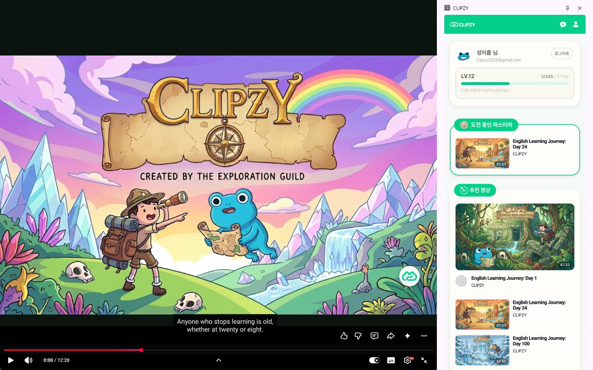
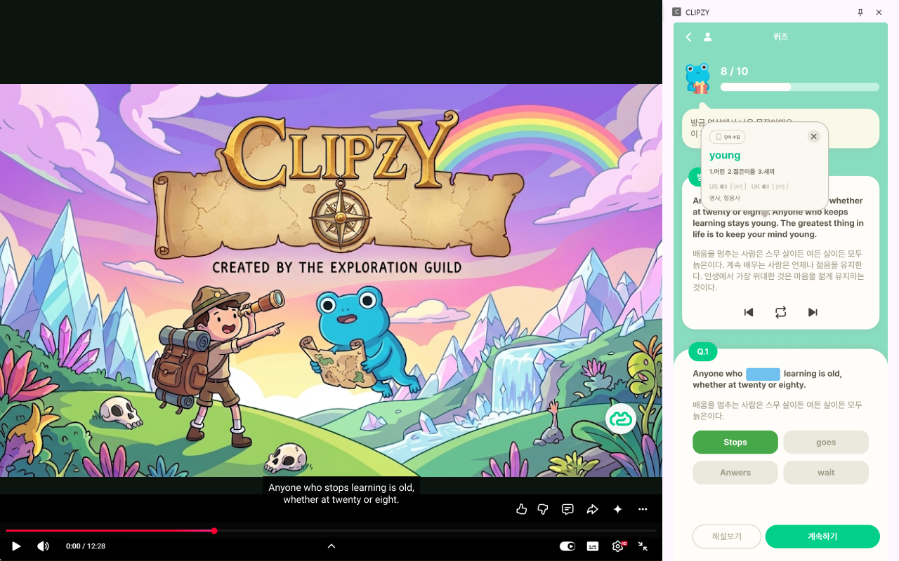
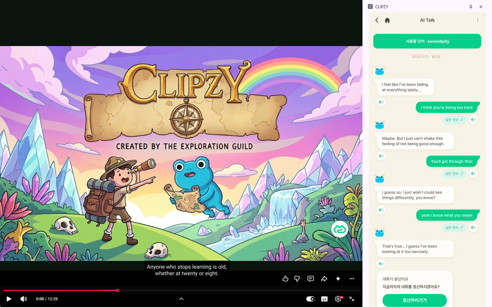
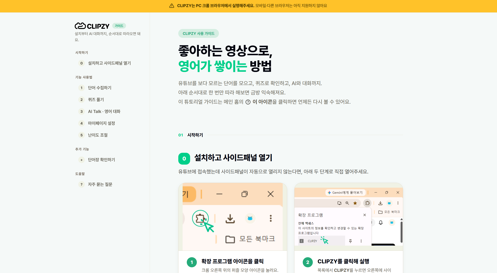
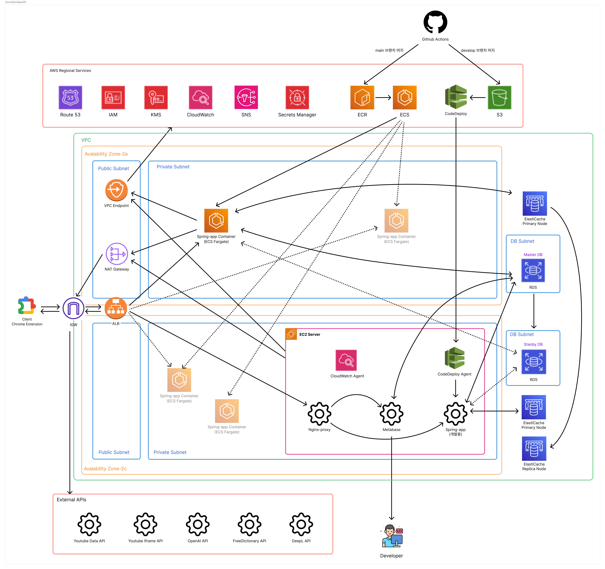

# 🐸 CLIPZY
> **유튜브로 영어 공부, 이제 자연스럽게**
>
> 좋아하는 유튜브 영상을 보면서 단어를 모으고, AI 퀴즈로 복습하는 크롬 확장 프로그램

---

## 📥 설치 및 사용

<p align="center">
  <strong>👇 아래 버튼을 클릭하여 Chrome 웹스토어에서 설치하세요!</strong>
</p>

<p align="center">
  <a href="https://chromewebstore.google.com/detail/clipzy/mcgnjdjgakffdoagkocfgemnmlndplai">
    
  </a>
</p>

<p align="center">
  
  
  
</p>

### 🚀 빠른 시작 가이드

| 단계 | 내용 |
|:---:|------|
| 1️⃣ | Chrome 웹스토어에서 **CLIPZY** 설치 |
| 2️⃣ | Chrome 우측 상단의 CLIPZY 아이콘 클릭 |
| 3️⃣ | **Google 계정**으로 로그인 |
| 4️⃣ | YouTube 영상 시청하며 사이드 패널에서 자막 확인 |
| 5️⃣ | 모르는 단어 클릭 → 단어장에 저장 |
| 6️⃣ | **AI 퀴즈**로 복습 + **AI 채팅**으로 회화 연습 |
---

## 📸 스크린샷

<table>
  <tr>
    <td align="center">
      
      <br><b>사이드 패널 & 추천 영상</b>
    </td>
    <td align="center">
      
      <br><b>AI 맞춤 퀴즈</b>
    </td>
    <td align="center">
      
      <br><b>AI 채팅 학습</b>
    </td>
  </tr>
</table>

---

## 🎬 데모 & 사용법 가이드

<p align="center">
  <a href="https://youtu.be/Zj8KIFEDGQQ">
    
  </a>
  &nbsp;&nbsp;
  <a href="https://clipzyguide.netlify.app/">
    
  </a>
</p>

<p align="center">
  <a href="https://clipzyguide.netlify.app/">
    
  </a>
  <br>
  <em>👆 CLIPZY 튜토리얼 페이지 - 클릭하여 방문</em>
</p>

---

## 📌 프로젝트 소개

### 🤔 왜 만들었나요?

영어 공부 앱은 많은데, 왜 중간에 그만두는 사람이 많을까요?

| 기존 서비스 | 문제점 |
|-------------|--------|
| **자막 학습 앱** (Language Reactor 등) | 도구만 주고 동기를 주지 않음, 내 수준에 맞는 영상 찾기 어려움 |
| **게임형 앱** (듀오링고, 말해보카 등) | 같은 문제 반복 → 답 외우는 느낌, 틀리면 의욕 저하 |

### 💡 CLIPZY의 해결 방법

**자막 학습의 편리함 + 게임의 재미 + AI의 맞춤 학습 + AI 대화 연습**

| 문제점 | CLIPZY의 해결                     |
|--------|--------------------------------|
| 동기 부여 없음 | 🎮 퀴즈 게임화 + 마스터리 등급으로 성취감      |
| 내 수준에 안 맞음 | 🧠 AI가 내가 모은 단어로 맞춤 퀴즈 생성      |
| 같은 문제 반복 | 🔄 OX, 빈칸, 매칭 다양한 퀴즈 형식        |
| 실전 활용 불가 | 💬 AI와 영어 대화로 배운 단어를 실제 회화에 적용 |

---

### ⭐ 핵심 기능

| 기능 | 설명                                        |
|------|-------------------------------------------|
| 🎬 **이중 자막** | 영상 위에 영어/한글 자막 동시 표시                      |
| 📚 **단어 수집** | 모르는 단어 호버 → 뜻 확인 → 원클릭 저장                 |
| 🧠 **AI 맞춤 퀴즈** | 내가 모은 단어와 영상 속 핵심 단어로 OX, 빈칸, 매칭 퀴즈 자동 생성 |
| 💬 **AI 텍스트 채팅** | 시나리오 기반으로 수집 단어를 활용한 영어 대화 연습 |
| 🎙️ **AI 음성 채팅** | STT/TTS 기반 실시간 음성 회화 연습                  |
| 📊 **성장 리포트** | 정답률, 레벨, 마스터리 등급으로 성장 확인                  |
| 🔥 **스트릭 시스템** | 연속 학습 추적 + 깨져도 복구 가능                      |
| 🎯 **영상 추천** | 내 수준과 목적에 맞는 다음 영상 자동 추천                  |

---

## 💬 AI 채팅 학습 (신규)

### 🎯 왜 추가했나요?

> **"퀴즈로 단어 외웠는데, 막상 실제 영어로 말하려니 입이 안 떨어져요"**

CLIPZY 사용자들의 가장 큰 페인포인트는 **"수집한 단어를 실전에서 어떻게 쓰지?"** 였습니다.  
이를 해결하기 위해 **AI와 직접 대화하며 단어를 실전 적용**할 수 있는 채팅 기능을 추가했습니다.

### ✨ 주요 특징

| 기능 | 설명 |
|------|------|
| 🎬 **시나리오 기반 대화** | 카페, 면접, 여행 등 실제 상황 시뮬레이션 |
| 📚 **수집 단어 활용** | 내가 모은 단어를 AI가 자연스럽게 대화에 녹여줌 |
| 💬 **텍스트 채팅** | 채팅처럼 메시지 주고받으며 영작 연습 |
| 🎙️ **음성 채팅** | STT/TTS 기반 실시간 음성 회화 |
| 🔄 **이어하기** | 중단된 대화 다음에 이어서 가능 |
| 🚨 **신고 기능** | 부적절한 AI 답변 / 시나리오 신고 |

### 🔄 동작 흐름

```
1. 사용자: 시나리오 선택
   예) "카페에서 주문하기", "면접 보기", "공항에서 길 묻기"
   ↓
2. AI: 시나리오에 맞춰 대화 시작
   ↓
3. 사용자: 영어로 응답 (텍스트 or 음성)
   ↓
4. AI: 수집한 단어를 자연스럽게 녹여서 답변
   ↓
5. 사용자: 학습 종료 시 만족도 평가
```
---

### 🎯 타겟 사용자

**"공부하긴 싫지만, 영어는 잘하고 싶은" 20~30대**

- 책상에 앉아 단어장 외우는 건 무겁고
- 영상만 보자니 실력이 느는지 모르겠고
- 게임형 앱은 같은 문제만 반복되어 질리는 분들

---

## ✅ MVP 구현 현황

### 완료된 기능

| 기능         | 설명                   | 상태 |
|------------|----------------------|:----:|
| 사이드 패널     | 크롬 우측 학습 패널   | ✅ |
| 이중 자막      | 사이드패널 영어/한글 자막 동시 표시   | ✅ |
| 단어 호버 & 수집 | 단어 클릭 시 뜻 표시 + 저장    | ✅ |
| OX 퀴즈      | 단어 뜻 맞추기             | ✅ |
| 빈칸 채우기 퀴즈  | 문장 내 단어 맞추기          | ✅ |
| 매칭 퀴즈      | 단어-뜻 연결하기            | ✅ |
| 정산 화면      | 학습 결과 요약             | ✅ |
| 마스터리 등급    | 영상별 Bronze/Silver/Gold 등급 | ✅ |
| **AI 텍스트 채팅**  | 수집 단어 기반 시나리오 영어 대화 연습 | ✅ |
| **AI 음성 채팅**  | STT/TTS 실시간 음성 회화 연습     | ✅ |
| **사용자 피드백**  | 만족도 평가 및 개선 의견 수집     | ✅ |
| **채팅 신고 기능**  | 부적절한 AI 답변/시나리오 신고      | ✅ |
| **관리자 페이지**  | 신고/피드백 관리 (운영팀 전용)     | ✅ |

---

## 📊 성과 지표

| 지표 | 값 |
|------|-----|
| 실사용자 수 | 48명 |
| 통계적 유의미 사용자 (5문제 이상 응답) | 22명 |
| Chrome 웹스토어 등록 | ✅ 완료 |
| 지원 브라우저 | Chrome (Manifest V3) |

---

## 🛠 기술 스택

| 분류 | 기술 |
|:----:|------|
| **Frontend** |     |
| **Backend** |     |
| **Database** |     |
| **Authentication** |   |
| **AI / API** |      |
| **Infra** |     |
| **CI/CD** |   |
| **Design** |  |
| **IDE** |   |
| **Collaboration** |       |
| **API Docs** |  |

---

## 🏗 시스템 아키텍처



### 주요 구성 요소

**Chrome Extension (Frontend)**
- Content Script: YouTube 자막 처리, DOM 조작
- Side Panel: 학습 UI (React + Vite)
- Background: 서비스 워커, API 프록시
- Manifest V3 기반

**Spring Boot Backend**
- Auth: Google OAuth 2.0 + JWT
- Chat: WebSocket + STOMP 실시간 채팅
- Quiz Engine: OX / 빈칸 / 매칭 3종 퀴즈 생성
- AI Agent Pipeline: 3-Layer 판단 시스템

**AI 서비스 통합**
- OpenAI GPT: 퀴즈 생성, Agent Orchestrator, AI 채팅
- Azure Speech: STT/TTS 음성 회화
- DeepL: 자막 번역
- Free Dictionary: 단어 뜻 조회

**Infrastructure**
- AWS ECS Fargate: 컨테이너 오케스트레이션
- Amazon RDS: MySQL (Master-Standby 이중화)
- ElastiCache: Redis 캐싱
- Nginx: Reverse Proxy
- CloudWatch: 모니터링
- GitHub Actions: CI/CD 자동화

---

## 🧠 AI Agent 아키텍처 (Round 3 신규)

### 🎯 왜 만들었나요?

CLIPZY 실사용자 **48명**을 대상으로 학습 데이터와 피드백을
수집하는 과정에서 **명확한 문제**를 발견했습니다.

**사용자의 목소리**

> *"문제 난이도가 사람마다 달랐으면 좋겠어요"*
>
> *"제 수준에 맞는 문제가 나오면 좋겠어요"*
>
> — 사용자 피드백 中

**데이터로 확인한 문제**

통계적 유의미성 확보를 위해 5문제 이상 응답한 22명의
정답률을 분석한 결과:

| 발견한 문제 | 데이터 근거 |
|-----------|-----------|
| 정답률 편차 극심 | 최저 33% ~ 최고 100% |
| 획일적 난이도 제공 | 실력과 무관하게 동일 문제 |
| 회화 약점 미반영 | 채팅에서 어려워한 표현이 퀴즈에 미출제 |
| 학습 경로 개인화 부재 | 부진층/우수층 동일 학습 흐름 |

이를 해결하기 위해 **사용자 상태를 분석하고 맞춤 전략을
결정하는 AI Agent 아키텍처**를 설계했습니다.

### ✨ 3-Layer Agent 파이프라인

| Layer | 역할 | 기술 |
|-------|------|------|
| **1. State Analyzer** | 사용자 학습 상태 통합 분석 | 4가지 컨텍스트 (프로필/이력/수집/채팅약점) |
| **2. Orchestrator (LLM)** | 학습 전략 결정 | OpenAI GPT + 한국어 판단 근거 반환 |
| **3. Word Selector** | 지능형 단어 선택 | 8가지 조건 스코어링 |

### 🎬 실행 예시

**사용자 상태:**
- 최근 정답률: 3.3%
- 취약 단어: 15개
- 채팅 약점: 10개

**Agent 판단:**
- Strategy: `OX_HEAVY / EASY / CHAT_WEAKNESS`
- Reason: "정답률이 매우 낮아 자신감 회복이 우선이며, 미해결 대화 약점이 많아 우선 보완합니다"

**단어 선택:**
- #1 `donate` score=118 (수집+100, 취약+10, 채팅약점+8)

### ⭐ 시그니처: 채팅↔퀴즈 크로스 도메인 루프

일반 영어앱은 회화와 단어 학습이 독립적이지만,
CLIPZY는 **채팅에서 발견된 약점을 자동으로 퀴즈에 반영**합니다.

```
[AI 채팅] 어색한 표현 사용
    ↓
[DB] user_weakness 저장
    ↓
[퀴즈 요청] Agent가 약점 조회
    ↓
[스코어링] 약점 관련 단어 +8점
    ↓
[결과] 해당 단어 우선 출제
```

### 📊 데이터 기반 임계값

실사용자 48명 중 통계적 신뢰도 확보를 위해 **5문제 이상
응답한 22명**의 정답률 분포를 백분위로 분석했습니다.

**정답률 4분위 분포**

| 분위 | 정답률 범위 | 인원 |
|------|-----------|-----|
| Q1 (하위 25%) | 33 ~ 71% | 6명 |
| Q2 (중하위 50%) | 73 ~ 78% | 6명 |
| Q3 (중상위 75%) | 87 ~ 88% | 5명 |
| Q4 (상위 25%) | 88 ~ 100% | 5명 |

이 분포를 기반으로 통계적 근거를 가진 Agent 전략 임계값을 결정했습니다.

### 🛡️ 3중 안전장치

- **Self-Correction**: AI가 실패 사유를 분석해 재시도
- **Retry**: 최대 3회 자동 재시도
- **Fallback**: 로컬 하드코딩 퀴즈로 서비스 연속성 보장

---
## 📊 성과

<div align="center">

| 지표 | 값 |
|:---:|:---:|
| 🛒 Chrome 웹스토어 등록 | ✅ 정식 배포 |
| 👥 실사용자 수 | **48명** |
| 📈 유의미 사용자 (5문제 이상) | **22명** |
| 🎯 지원 퀴즈 유형 | 3종 (OX / 빈칸 / 매칭) |
| 🛡️ AI 응답 안정성 | 100% (Fallback 포함) |

</div>

---

## 🔧 개발 환경 설정

> 💡 일반 사용자는 위의 [빠른 시작 가이드](#-빠른-시작-가이드)를 참고하세요.
> 이 섹션은 로컬에서 프로젝트를 실행하려는 **개발자용** 가이드입니다.

### 사전 준비

- JDK 17+
- Node.js 18+
- MySQL 8.0+
- Redis 7.0+

### 1. Backend 실행

```bash
cd backend
cp src/main/resources/application-example.yml src/main/resources/application.yml
# application.yml에 DB, OpenAI, Azure, DeepL 키 설정

./gradlew bootRun
```

### 2. Frontend (Chrome Extension) 빌드

```bash
cd frontend
npm install
npm run build
```

### 3. Chrome에 확장 프로그램 로드

1. Chrome 주소창에 `chrome://extensions` 입력
2. 우측 상단 **"개발자 모드"** 활성화
3. **"압축해제된 확장 프로그램을 로드합니다"** 클릭
4. `frontend/dist` 폴더 선택

---

## 📘 API 문서
- 📄 [API 명세서 ](https://www.hancomdocs.com/open?fileId=wZbOrQDSuKvTEZrMh8c1jQfQjNqFnOx5)

---


## 📁 프로젝트 구조

```
CLIP
│
├── 📁 .github/
│   └── 📁 workflows/               # GitHub Actions CI/CD
│       ├── 📄 cd.yml               # 배포 자동화
│       └── 📄 ci.yml               # 빌드/테스트 자동화
│
├── 📁 frontend/                    # Chrome Extension (React + Vite)
│   ├── 📁 src/
│   │   ├── 📁 components/          # UI 컴포넌트
│   │   ├── 📁 imgs/                # 이미지 파일
│   │   ├── 📁 utils/               # 유틸 함수
│   │   ├── 📄 App.jsx              # 사이드패널 메인 컴포넌트
│   │   ├── 📄 background.js        # 서비스 워커 (사이드패널 관리, API 프록시)
│   │   ├── 📄 content.jsx          # 콘텐츠 스크립트 (자막 처리, 퀴즈 트리거)
│   │   ├── 📄 inject.js            # YouTube 자막 API 가로채기 (MAIN world)
│   │   └── 📄 main.jsx
│   ├── 📄 manifest.json            # 크롬 익스텐션 설정 (MV3)
│   ├── 📄 sidepanel.html
│   ├── 📄 vite.config.js
│   └── 📄 package.json
│
├── 📁 backend/                     # Spring Boot API Server
│   └── 📁 src/
│   │   ├── 📁 main/
│   │   │   ├── 📁 java/com/clip/server/
│   │   │   │   ├── 📁 admin/       # 관리자 (인증/관리)
│   │   │   │   ├── 📁 auth/        # 인증 (Google OAuth, JWT)
│   │   │   │   ├── 📁 chat/        # AI 채팅 (텍스트/음성)
│   │   │   │   ├── 📁 common/      # 공통 모듈
│   │   │   │   ├── 📁 feedback/    # 사용자 피드백
│   │   │   │   ├── 📁 file/        # 채팅 음성 파일
│   │   │   │   ├── 📁 progress/    # 학습 진행 관리
│   │   │   │   ├── 📁 quiz/        # 퀴즈 기능
│   │   │   │   ├── 📁 report/      # 신고 기능
│   │   │   │   ├── 📁 subtitle/    # 자막 처리
│   │   │   │   ├── 📁 translation/ # 번역 기능
│   │   │   │   ├── 📁 user/        # 사용자 관리
│   │   │   │   ├── 📁 video/       # 영상 관리
│   │   │   │   ├── 📁 word/        # 단어 수집
│   │   │   │   └── 📄 ClipServerApplication.java
│   │   │   └── 📁 resources/
│   │   └── 📁 test/                # 테스트 코드
│   ├── 📁 nginx/                   # Nginx 설정
│   ├── 📄 Dockerfile               # Docker 이미지 설정
│   └── 📄 docker-compose.yaml      # 컨테이너 구성
├── 📄 .gitignore
└── 📄 README.md
```

---

## 🚀 배포 현황

| 구분 |     상태      |
|:----:|:-----------:|
| Backend API |   ✅ 배포 완료   |
| Chrome Extension | ✅ 스토어 등록 완료 |

---

<details>
<summary>📘 개발 컨벤션</summary>

### 1️⃣ 브랜치 관련

각 파트별로 브랜치 생성해두었습니다. 본인 파트에 맞는 브랜치로 작업해주세요.

| 브랜치 | 파트 |
|--------|------|
| `frontend` | 프론트엔드 |
| `backend` | 백엔드 |
| `design` | 디자인 |
| `infra` | 인프라 |
| `develop` | 통합 브랜치 |
| `main` | 배포 브랜치 **(직접 수정 금지)** |

---

### 2️⃣ 작업 순서

**1) 작업 전 최신화**
- 새로운 작업을 시작하기 전에 팀원들의 최신 코드를 가져오는 용도
```bash
git checkout [본인 브랜치명]
git pull origin develop
```

**2) 작업 완료 및 업로드**
- 코드 작성을 마친 뒤, 내 브랜치에 안전하게 저장하고 올리는 용도
```bash
git add .
git commit -m "feat: 로그인 기능 구현"
git pull origin develop
git push origin [본인-브랜치-명]
```

---

### 3️⃣ PR(Pull Request) 관련

- PR은 특정 기능 개발 완료 후, 단위 테스트까지 마친 뒤에 부탁드립니다.
- PR 방향: `본인 브랜치` → `develop`
- PR 이후 단톡방에 메시지 남겨주시면 develop 브랜치에 merge 하겠습니다.

---

### 4️⃣ 주의사항

- ❌ main, develop 브랜치에 직접 push 금지!
- ✅ 충돌 발생 시 팀원과 상의
- 🔒 API Key 관리 안내

```
보안을 위해 모든 API Key는 .env 파일에서 관리합니다.
.env 파일은 절대 GitHub에 push하지 마세요. (이미 .gitignore에 등록됨)
필요한 API Key 목록은 [우리 팀 노션 페이지]에서 확인 후 로컬에 복사해서 사용해 주세요.
```

---

### 5️⃣ 커밋 메시지 규칙

| 타입 | 설명 |
|------|------|
| `[feat]` | 새 기능 추가 |
| `[fix]` | 버그 수정 |
| `[docs]` | 문서 수정 |
| `[style]` | 코드 포맷팅 |
| `[refactor]` | 리팩토링 |

</details>